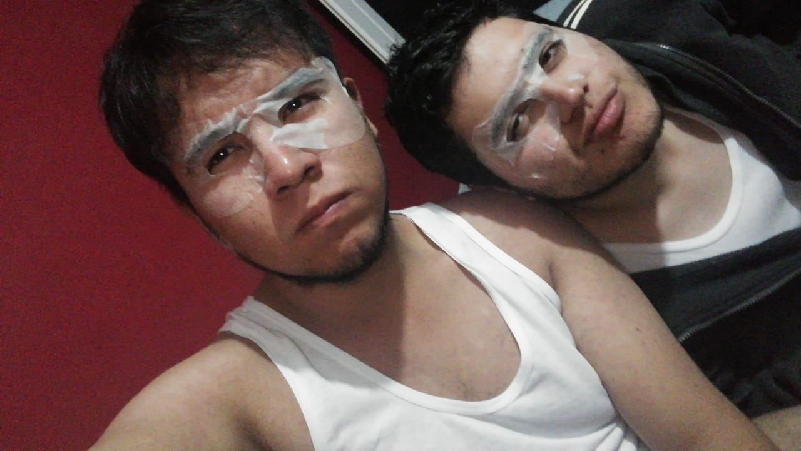

<!doctype html>
<html>
	<head>
	</head>
	
		<body background="img/G1.gif" text="#E70000">

<i><u>
20/01/19

 
<u>
1...2...3...4...5...6 meses

 

<i>Te quiero mucho</i> (por la integral de todo lo demas 7u7) 

<i>
Tadeo Santiago

Espero que te guste el pequeño mundo que hice en HTML

	

 
<table>

<table border="2">
<tr>
	<td>Lugar</td>
	<td>Foto</td>
	<td>Canciones</td>
</tr>
<tr>
	<td>El planetario</td>
	<td>

</td>
	<td><audio controls="audiocontrols"><source src="audio/Dos Soledades.mp3"></audio></td>
</tr>
<tr>
	<td>Casi nos mata una rama</td>
	<td>

</td>
	<td><audio controls="audiocontrols"><source src="audio/Birtday.mp3"></audio></td>
</tr>
<tr>
	<td>Chapu</td>
	<td>

</td>
	<td><audio controls="audiocontrols"><source src="audio/Mi Persona Favorita.mp3"></audio></td>
</tr>
<tr>
	<td>Me enseñaste CU</td>
	<td>

</td>
	<td><audio controls="audiocontrols"><source src="audio/No Hay Nadie Más.mp3"></audio></td>
</tr>
<tr>
	<td>Muchas ganas de estar chingando xD</td>
	<td>

</td>
	<td><audio controls="audiocontrols"><source src="audio/Maire Pobre Gatito.mp3"></audio></td>
</tr>
<tr>
	<td>Chapu y su lado gatuno</td>
	<td>

</td>
	<td><audio controls="audiocontrols"><source src="audio/Maire silicon.mp3"></audio></td>
</tr>
<tr>
	<td>Cineteca y el terrors</td>
	<td>

</td>
	<td><audio controls="audiocontrols"><source src="audio/Un Amor de Verdad.m4a"></audio></td>
</tr>
<tr>
	<td>Chalco y tu casa</td>
	<td>

</td>
	<td><audio controls="audiocontrols"><source src="audio/Ven A Mí.mp3"></audio></td>
</tr>
<tr>
	<td>La primera vez cocinando juntos</td>
	<td>

</td>
	<td><audio controls="audiocontrols"><source src="audio/Contigo puedo ser quien soy.mp3"></audio></td>
</tr>
<tr>
	<td>Museo de la luz</td>
	<td>

</td>
	<td><audio controls="audiocontrols"><source src="audio/Shallow.mp3"></audio></td>
</tr>
<tr>
	<td>Desfile de día de muertos</td>
	<td>

</td>
	<td><audio controls="audiocontrols"><source src="audio/Dark Horse.mp3"></audio></td>
</tr>
<tr>
	<td>FAC ING</td>
	<td>

</td>
	<td><audio controls="audiocontrols"><source src="audio/Me estoy enamorando.mp3"></audio></td>
</tr>

<tr>
	<td>Primer concierto juntos</td>
	<td>

</td>
	<td><audio controls="audiocontrols"><source src="audio/Arwrarwrirwrarwro.mp3"></audio></td>
</tr>
<tr>
	<td>CCH</td>
	<td>

</td>
	<td><audio controls="audiocontrols"><source src="audio/Son pololos.mp3"></audio></td>
</tr>
<tr>
	<td>Animales Fantasticos (Relleno...Relleno...Relleno...)</td>
	<td>

</td>
	<td><audio controls="audiocontrols"><source src="audio/Mi muñeca me hablo.mp3"></audio></td>
</tr>
<tr>
	<td>Nuestro libro de aventuras</td>
	<td>

</td>
	<td><audio controls="audiocontrols"><source src="audio/Better.mp3"></audio></td>
</tr>

</table>
	
		</body bgcolor="red">

</html>
